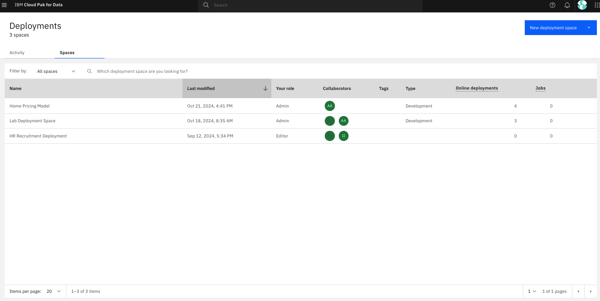
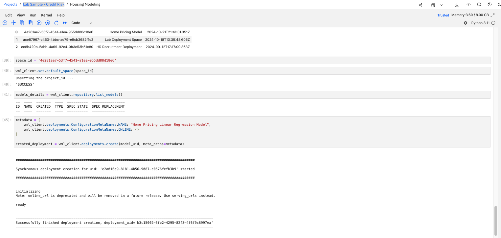

# Creating a Model for tracking in watsonx.governance

This tutorial guides you through the process of creating a Home Pricing regression model using Projects on Cloud Pak for Data via an existing Jupyter Notebook.

## Step 1: Create a Deployment Space

**Role: Data Scientist or ML Engineer**

1. Log into Cloud Pak for Data using your credentials.
2. In the top-left corner, click on the hamburger menu and select "Deployments". Click the "Spaces" Tab at the top.

4. In the top-right corner, clock on "New deployment space".
5. Provide a meaningful name with your initials (e.g., "Home Pricing Lab - AP") for your space, put it in Development stage, and create it.
6. You have now created a space which will contain deployable assets, deployments, deployment jobs, associated input and output data, and the associated environments. You can use spaces to deploy various assets and manage your deployments. Deployment spaces are not associated with projects. You can promote assets from multiple projects to a space, and you can deploy assets to more than one space. For example, you might have a test space for evaluating deployments, and a production space for deployments that you want to deploy in business applications.

## Step 2: Set Up Your Project

**Role: Data Scientist or ML Engineer**

1. In the top-left corner, click on the hamburger menu and select "Projects".
2. Click "New project" and select "Create an empty project".
3. Provide a meaningful name with your initials (e.g., "Home Pricing Dev - AP") and description for your project.
4. Click "Create" to finalize the project setup.
5. You have now created a Project! A project is a collaborative workspace where you work with data and other assets to accomplish a particular goal.
Your project can include these types of resources:

- Collaborators are the people who you work with in your project.
- Data assets are what you work with. Data assets often consist of raw data that you work with to refine.
- Tools and their associated assets are how you work with data.
- Environments are how you configure compute resources for running assets in tools.
- Jobs are how you manage and schedule the running of assets in tools.
- Project documentation and notifications are how you stay informed about what's happening in the project.
- Asset storage is where project information and files are stored.
- Integrations are how you incorporate external tools.
- Services are how you add tools or processing power to your project.
- Catalogs are how you share assets between projects.

## Step 3: Import the Jupyter Notebook

**Role: Data Scientist**

1. In your project, click "Add to project" in the top-right corner and select "Notebook".
2. Choose "From URL" and enter this URL: `https://github.com/ashwinpo/watsonx-gov-lab/blob/main/Housing%20Modeling.ipynb`.
3. For the runtime environment, select one of the runtimes with Python 3.11.
4. Click "Create" to import the notebook.
   

## Step 4: Run the Notebook

**Role: Data Scientist**

If you're creating a new model:

1. Open the imported notebook.
2. Execute each cell in order, following any inline instructions.
3. You will need to add your user credentials to one of the code blocks when deploying the model from code.
4. After running all cells, you should have a trained Home Pricing regression model saved in your project.

5. Download the training and testing files locally. (see them in the project view > click the elipses on the right > select download)

## Step 5: Setup Monitoring for the Model

**Role: Data Scientist**

