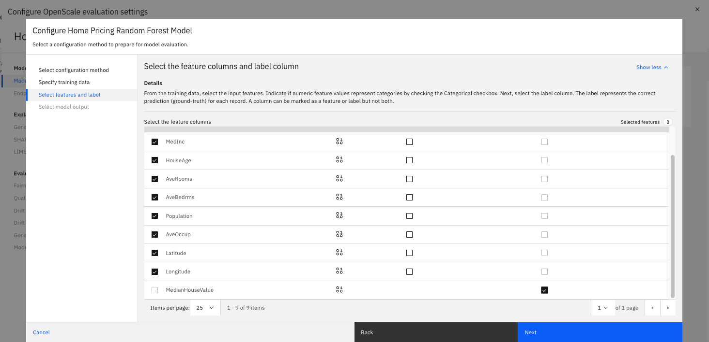

# Creating a Model for tracking in watsonx.governance

This tutorial guides you through the process of creating a Home Pricing regression model using Projects on Cloud Pak for Data via an existing Jupyter Notebook.

## Step 1: Generate your API Key
If you already have your Cloud 
1. When we deploy our regression model later on, you will need the API key associated with your Cloud Pak for Data account. This can be done easily by clicking on your profile logo in the top right.
2. Click Profile and Settings
3. In the top right, select API Key

5. Generate a new Key and save this key someplace secure for future use.
   
## Step 2: Create a Deployment Space

**Role: Data Scientist or ML Engineer**

1. Log into Cloud Pak for Data using your credentials.
2. In the top-left corner, click on the hamburger menu and select "Deployments". Click the "Spaces" Tab at the top.

4. In the top-right corner, click on "New deployment space".
5. Provide a meaningful name with your initials (e.g., "Home Pricing Lab - AP") for your space, put it in Development stage, and create it.
6. You have now created a space which will contain deployable assets, deployments, deployment jobs, associated input and output data, and the associated environments. You can use spaces to deploy various assets and manage your deployments. Deployment spaces are not associated with projects. You can promote assets from multiple projects to a space, and you can deploy assets to more than one space. For example, you might have a test space for evaluating deployments, and a production space for deployments that you want to deploy in business applications.

## Step 3: Set Up Your Project

**Role: Data Scientist or ML Engineer**

1. In the top-left corner, click on the hamburger menu and select "All Projects" under Projects.
2. Click "New project" and select "Create an empty project".
3. Provide a meaningful name with your initials (e.g., "Home Pricing Dev - AP") and a description for your project.
4. Click "Create" to finalize the project setup.
5. You have now created a Project! A project is a collaborative workspace where you work with data and other assets to accomplish a particular goal.
Your project can include these types of resources:

- Collaborators are the people who you work within your project.
- Data assets are what you work with. Data assets often consist of raw data that you work with to refine.
- Tools and their associated assets are how you work with data.
- Environments are how you configure compute resources for running assets in tools.
- Jobs are how you manage and schedule the running of assets in tools.
- Project documentation and notifications are how you stay informed about what's happening in the project.
- Asset storage is where project information and files are stored.
- Integrations are how you incorporate external tools.
- Services are how you add tools or processing power to your project.
- Catalogs are how you share assets between projects.

## Step 4: Import the Jupyter Notebook

**Role: Data Scientist**

1. In your project, click "Add to project" in the top-right corner and select "Notebook".
2. Choose "From URL" on the left sidebar and enter this URL: `https://github.com/ashwinpo/watsonx-gov-lab/blob/main/Housing%20Modeling.ipynb`.

3. For the runtime environment, select the runtime called `Runtime 24.1 on Python 3.11`. You can see this template environment comes with 1 vCPU and 2 GB of RAM. You can create templates with custom hardware specifications and libraries. For now, this isn't necessary.
4. Click "Create" to import the notebook.
   
## Step 5: Run the Notebook

**Role: Data Scientist**

If you're creating a new model:

1. Open the imported notebook.
2. Execute each cell in order, following any inline instructions.
3. You will need to add your user credentials to one of the code blocks when deploying the model from code.
4. You will need to identify the Space ID associated with the Space Name you established in Step 2.
5. After running all cells, you should have a trained Home Pricing regression model saved in your project.

6. Download the training and testing files locally. (see them in the project view > click the ellipses on the right > select download)

## Step 6: Setup Monitoring for the Model

**Role: Data Scientist**

1. In the top-left corner, click on the hamburger menu and select "Deployments". Click the "Spaces" Tab at the top.
2. Find the Space you created in Step 2. Click into it.
3. See the Models you just deployed under Deployments.
**Note**: You could have alternatively saved the model to a project and use the UI to promote it to a Space and subsequently deploy it in this Space. Instead we deployed programmaticallly.
4. Click into the Home Pricing Random Forest Model. Go to the "Evaluations" tab.
5. Click Configure OpenScale evaluation Settings.

6. Use these settings: System Managed, Numeric/Categorical, Regression. Click Next.

7. Upload the training data file (`training_dataset_housing.csv`) and set it as comma separated -- If you did not download this, simply go back to the project you had created and find the csv file > click the ellipses on the right > select download. Click Next.

8. Select all the features (should be done by default) and set MedianHouseValue as the Label. Click Next.

9. Check Prediction box. Click Next.
10. Validate the summary looks like below.

11. Click into Explanability > General Settings. Click the edit icon on the Explanation method tile and set it to default (LIME). Click save.

12. Click into Fairness. Click the edit icon on the Configuration tile and create a range for [0,3] and [3.001, 5]. Set the lower range to unfavorable and higher range to favorable. We are essentially documenting that higher home price values are a favorable outcome in this case. This context will depend on the use-case and model implementation.

13. Use default settings and thresholds. Let's evaluate the Fairness of the MedInc variable (just for practice). Create ranges as you see in the image below to monitor lower income households. Save this configuration.

14. Building off what you know, monitor all the features for Drift (use v2) as an exercise! Use the default sample size and thresholds. Click save once done.
15. You can now exit out of the popup window and you should see the Evaluation screen update to await feedback.

16. Select the Actions button to evaluate now. Upload the test data as a csv that you downloaded in the previous step. Click Upload and Evaluate.

17. You've now configured your model for monitoring and done the first evaluation! You can now proceed with lab 1 on the Home screen!

