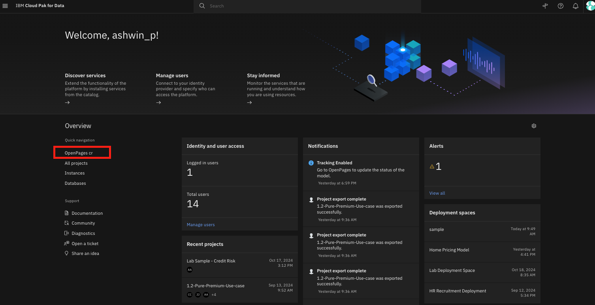
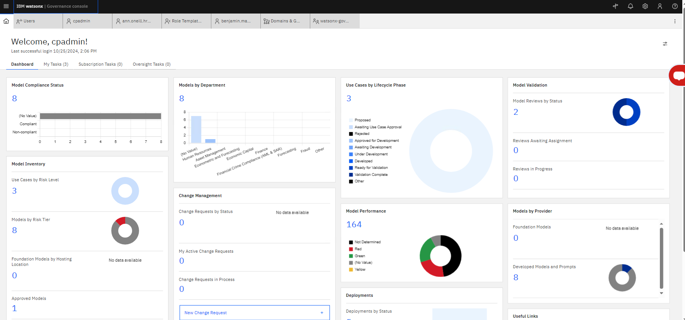
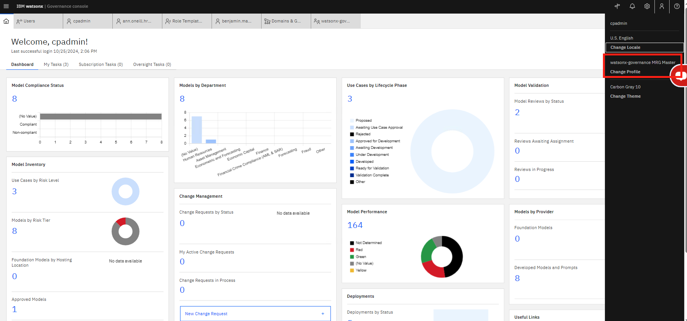

# Quick Access to Governance Console on Cloud Pak for Data

After logging into Cloud Pak for Data, you will be directed to the home page. If you are already logged in and want to navigate home, simply click on the IBM Cloud Pak for Data logo in the top left hand corner

## Opening the Governance Console

In the Overview on the left side, see the Navigation menu with quick links. The first will be "OpenPages cr". Click that button.

## Validating you have the correct profile

You should see a dashboard like the one below.

If not, let's make sure you are on the right profile. A Profile configures the user interface (UI) for a set of users. You will have more than one profile in your  system which will grant you access to different views.

Click on the persona icon in the top right. Click change profile > 
    
    - **watsonx-goverance MRG Master**: This will configure the UI to align with MRG use-cases. If you want to see a pre populated dashboard -- select this.
    - **watsonx-goverance Modules Master**: This will give you all the necessary permissions to create your own workflows. **Default to this.**

**Note**: If you still do not see a home dashboard like the image above, then please contact an IBMer to assess your user permissions.