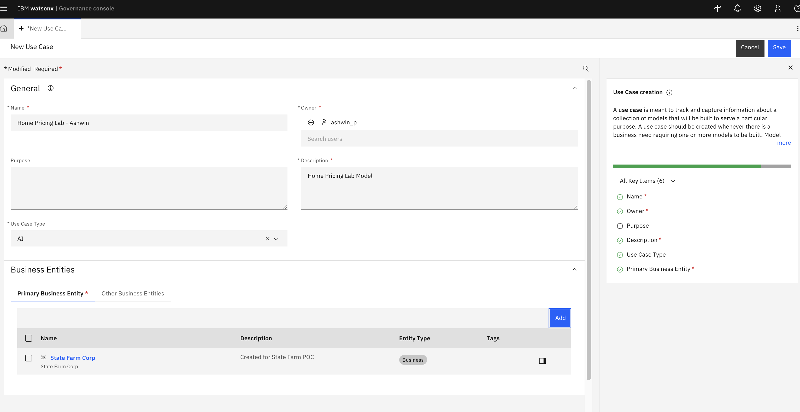
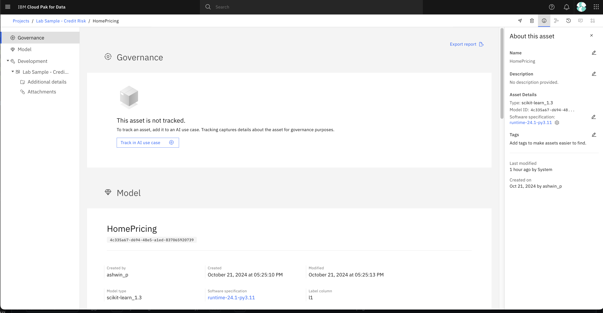
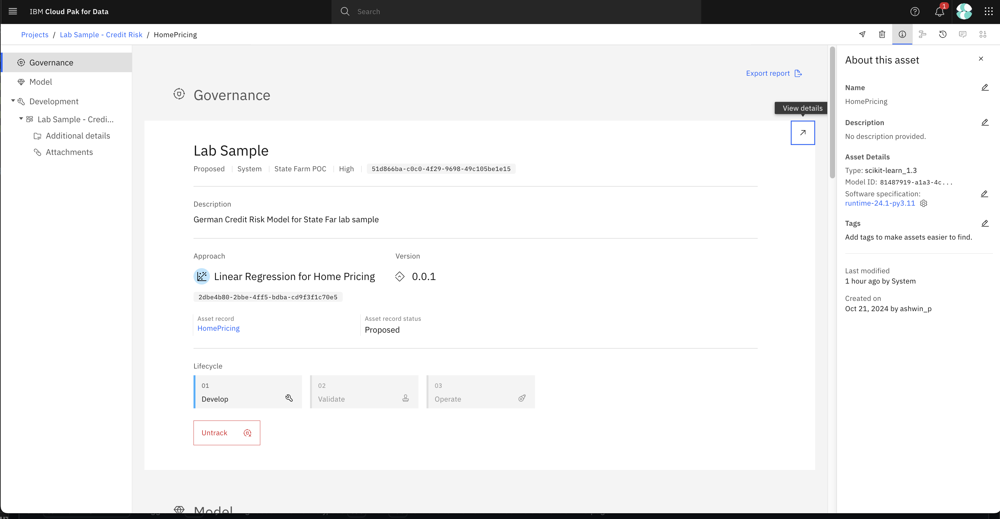
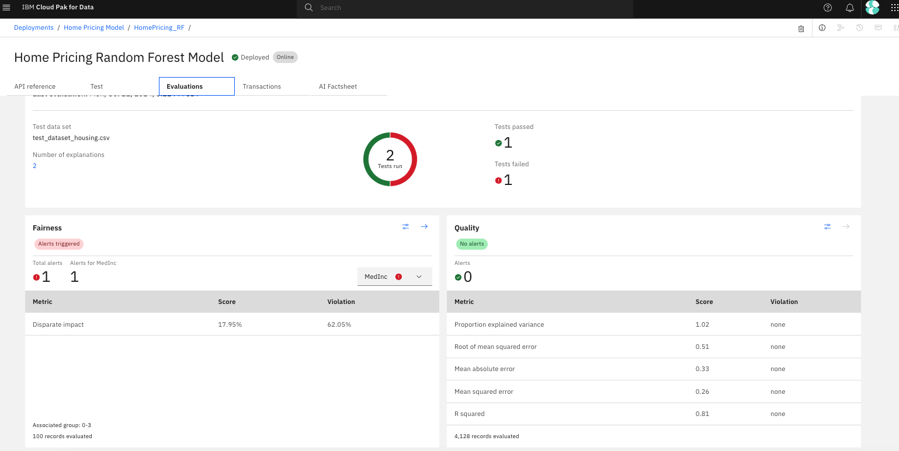
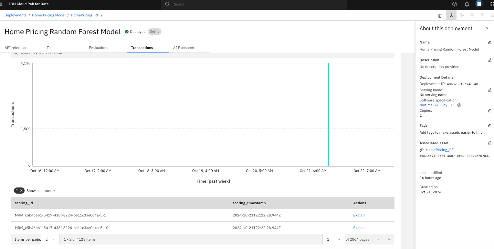
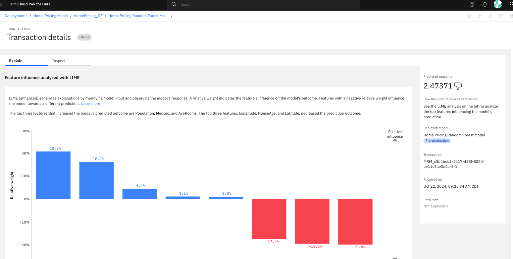

# watsonx.Governance Starter Lab

This quick tutorial guides you through the process of managing the lifecycle of a Home Pricing regression model using watsonx.governance. We'll cover both the optional creation of a new model and the management of an existing one, demonstrating how different roles within an organization interact with the AI governance process.

**Note**: This is a tailored set of labs and instructions NOT official product documentation which can be found [here](https://dataplatform.cloud.ibm.com/docs/content/wsj/analyze-data/xgov-overview.html?context=wx).

## Prerequisites

- Access to Cloud Pak for Data environment
- (Optional) Familiarity with Python for model creation

## Step 1 (OPTIONAL): Create and deploy your own Regression Model
Follow instructions [here](https://ashwinpo.github.io/watsonx-gov-lab/docs/Creating-a-Model.html)
If you decided to skip this step, please use the Home Pricing Random Forest Model that has already been created and deployed for the following steps.

## Step 2: Create an AI Use Case in watsonx.governance

**Role: Model Owner or Model Risk Manager**

1. Expand the left hamburger menu, select "AI use cases" under "AI Governance".
2. Click "New AI use case" (this will open a new tab in the governance console) and provide the following details:
   - Name: "Home Pricing Model - <Your Name>"
   - Description: "Predicting Median Home Value to improve coverage assessment accuracy"
   - Owner: Select your username by searching for it
   - Use-Case Type: AI
   - Business Entities: Add State Farm Corp which is a glossary of business entities we've created as a sample
     
3. Click "Save" to establish the AI use case.

4. An AI use case can reference multiple machine learning models that you can use to solve business problems. Then, data engineers and model evaluators can add models to the model use case and track the model as it progresses through its lifecycle. We will look more into the capabilities of the governance console at a later point, but for now just examine the left hamburger menu of the governance console.
5. Return to the previous tab which will have "IBM Cloud Pak for Data" in the top left.

## Step 3: Track the Model in watsonx.governance

**Role: Data Scientist or ML Engineer**

1. Ensure you are back in the tab with "IBM Cloud Pak for Data" in the top left. Simply login in a new tab if you lost this screen.
2. Expand the left hamburger menu, and go to Projects. If you created your own project, select that project. Otherwise, select the Project named "Lab Sample - Home Pricing".
3. Click on the model "HomePricing_LR".

**Note**: Steps 4 through 7 may already be done if you are using the Lab Sample project. This just means that we have already tracked this model to an AI Use Case. In this case, you can skip to step 8.
4. Click "Track asset" to associate it with your AI use case.

5. Select the appropriate approach (Linear Regression for LR, Decision Tree for RF) and version for your model.
6. Create a New Record for this asset
7. Set it as experimental for now and save.

**Note**: Start here if the model is already being tracked to a Use Case.
8. Export the AI Factsheet Report as a PDF by clicking the link in the top right and explore the provided document.
9. Click the arrow in the top right corner of the Governance tile to view details which will take you to the AI Use Case view again. Observe how this model is now in the development segment of the Lifecycle view.
   

## Step 4: Monitor and Manage the Model

**Role: Data Scientist or ML Engineer**

1. Expand the left hamburger menu, and go to Deployments. Go to Spaces and find the space you deployed or Lab Sample - Home Pricing if you skipped the model creation steps.
2. Click on a model's name to open its deployment details.
3. Navigate to the "Evaluations" tab (**Note**: If you this tab suggests Monitoring still needs to be setup, try another model where this is already setup. Or you may have missed this step in the Model Creation optional portion)
   
4. Here we can see the following evaluation dimensions specific to regression and any violation of thresholds:
   - Mean Absolute Error (MAE)
   - Root Mean Square Error (RMSE)
   - R-squared (R²)
   - Fairness Evaluation
   - Data Drift
5. Navigate to the "Transactions" tab
 
6. Click the bar with most recent transactions on the chart. You should see transactions appear at the bottom in a table.
7. Click the Explain button to see the feature influence analysis.
 

## Conclusion

You've now explored some of the lifecycle management capabilities for a regression model using watsonx.governance. This process ensures that your AI models are not only performant but also trackable, monitorable, and compliant with your organization's governance policies.

